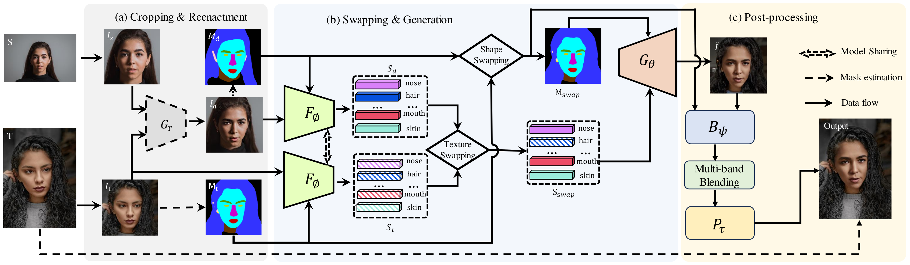
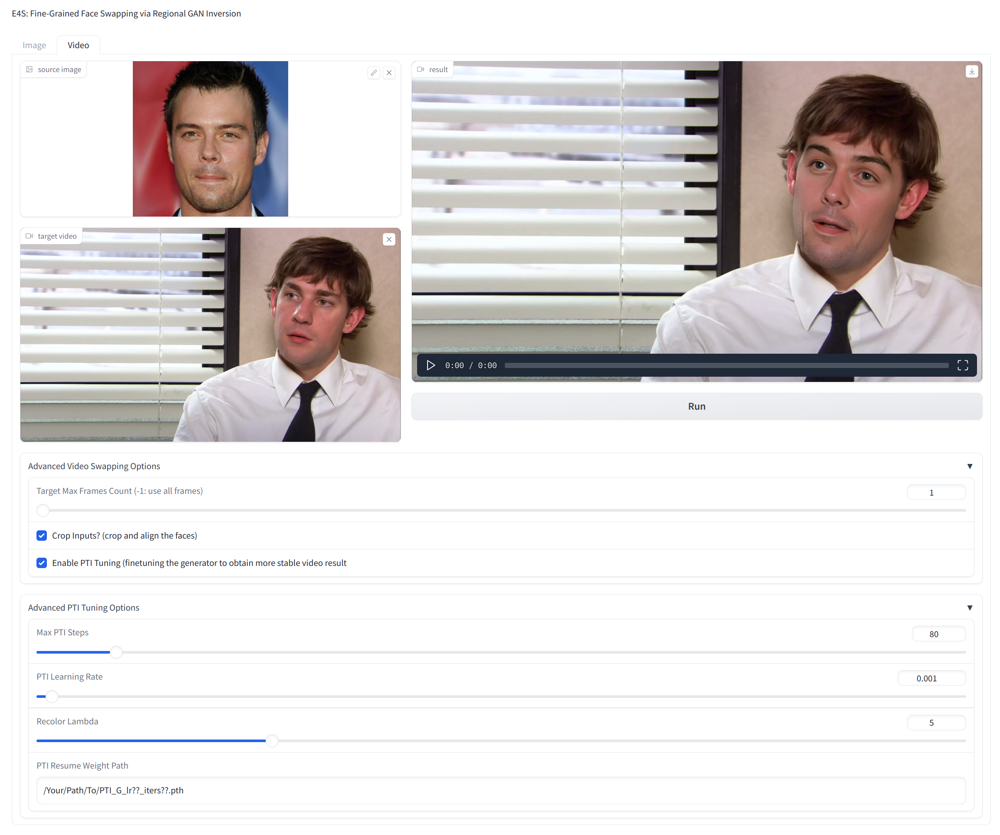

# E4S: Fine-Grained Face Swapping via Regional GAN Inversion (Under Review)

[Maomao Li](https://scholar.google.com/citations?user=ym_t6QYAAAAJ&hl=en&oi=ao), 
[Ge Yuan](https://ygtxr1997.github.io/), 
[Cairong Wang](), 
[Zhian Liu](), 
[Yong Zhang](https://yzhang2016.github.io/), 
[Yongwei Nie](https://nieyongwei.net/), 
[Jue Wang](https://juewang725.github.io/), 
[Dong Xu](https://scholar.google.com/citations?user=7Hdu5k4AAAAJ&hl=en&oi=ao)


<a href='https://arxiv.org/abs/2310.15081'></a> 
<a href='https://e4s2023.github.io/'></a>
[](https://github.com/e4s2023/E4S2023)


<div align="center">
    
</div>

## 🦴 Abstract

### TL;DR: A Face Swapping and Editing Framework Based on StyleGAN Latent Space


## 📋 Changelog

- **2023.10.21** Code and paper are released!

## 🏗️ Todo

- [x] Release the image and video face swapping code
- [ ] Delete unuseful code
- [ ] Release the face editing code

## 🚀 Differences with [E4S(CVPR2023)](https://github.com/e4s2022/e4s)

1. Re-coloring modules producing more consistent **facial color**
2. Inpainting the mismatch **face shape**
3. Stable and temporal-consistent **video face swapping** results

## 🌏 Setup Environment
Our code is mainly based on python3.10+, pytorch2.0+, cuda12+, etc. 
```shell
conda create -n e4s2023 python=3.10
conda activate e4s2023
pip install -r requirements.txt
export PYTHONPATH=$PWD
```

## 🍱 Pretrained Weights

All the weights (including our E4S weights and other third_party weights) can be downloaded from [here](https://mail2sysueducn-my.sharepoint.com/:f:/g/personal/yuang7_mail2_sysu_edu_cn/ErbjYVK4hZlDtsK8hK7REKMBldiZs2v5UddoyMIk-_2_Kw?e=WA4dQF).
Please put all of them into `./pretrained` like this:

```shell
pretrained
├── codeformer/
├── E4S/
├── face_blender/
├── faceseg/
├── faceVid2Vid/
├── GPEN/
├── inpainting/
├── pixel2style2pixel/
├── pose/
├── SwinIR/
└── zhian/
```
## 🍳 WebUI Inference Demo

Run face swapping gradio web-ui demo on your machine locally:
```
git clone https://github.com/e4s2023/E4S2023.git
python gradio_swap.py
```

<div align="center">
    
</div>

## 💆‍♀️ Image Face Swapping

<div align="center">
    
</div>

## 💃 Video Face Swapping

We follow [STIT](https://github.com/rotemtzaban/STIT/tree/main) and [AllInOneDeFliker](https://github.com/ChenyangLEI/All-In-One-Deflicker) to make the video face swapping results more stable,
which is detailed in our [paper](). 
This repo only contains the [PTI](https://github.com/danielroich/PTI) tuning step of STIT.
We found that the PTI tuning step is sufficient to help the StyleGAN to generate stable video frames.
This repo has not incorporated the AllInOneDeFliker code yet.
You may visit their [GitHub](https://github.com/ChenyangLEI/All-In-One-Deflicker) page for furthermore post-processing on PTI tuning frames.

Click [https://e4s2023.github.io/](https://e4s2023.github.io/) to see our video face swapping results.

<div align="center">
    
</div>

<div align="center">
    
</div>

## 📎 Citation 

```
@misc{liE4S
    Author = {Maomao Li and Ge Yuan and Cairong Wang and Zhian Liu and Yong Zhang and Yongwei Nie and Jue Wang and Dong Xu},
    Title = {E4S: Fine-Grained Face Swapping via Regional GAN Inversion},
    Year = {2023},
    Eprint = {arXiv:xxxx},
}
``` 


## 💌 Acknowledgements

This repository borrows heavily from [E4S(CVPR2023)](https://github.com/e4s2022/e4s) and [STIT](https://github.com/rotemtzaban/STIT/tree/main). 
Thanks to the authors for sharing their code and models.

## 📣 Disclaimer

This is not an official product of Tencent.
All the copyrights of the demo images and audio are from community users. 
Feel free to contact us if you would like remove them.